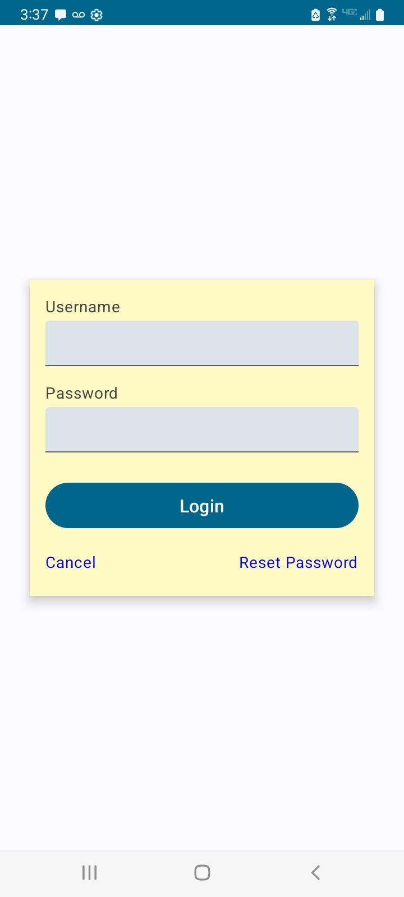

This code represents a basic login screen using Jetpack Compose. It includes the necessary UI elements such as text fields for username and password, a login button, and options for canceling and 
resetting the password. The code can be further customized and styled to match the desired appearance. Additionally, it can be extended for functionality by adding validations, authentication logic, 
and handling user interactions based on specific requirements. A starting point for building a login screen in Jetpack Compose, and have the flexibility to enhance it as per specific needs.

