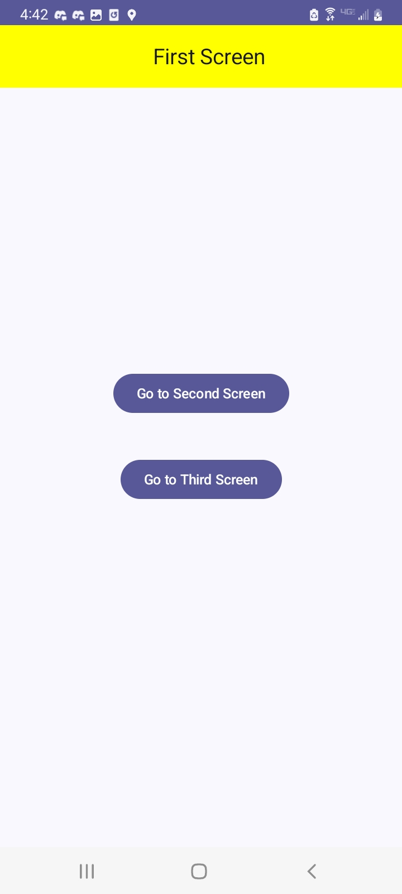
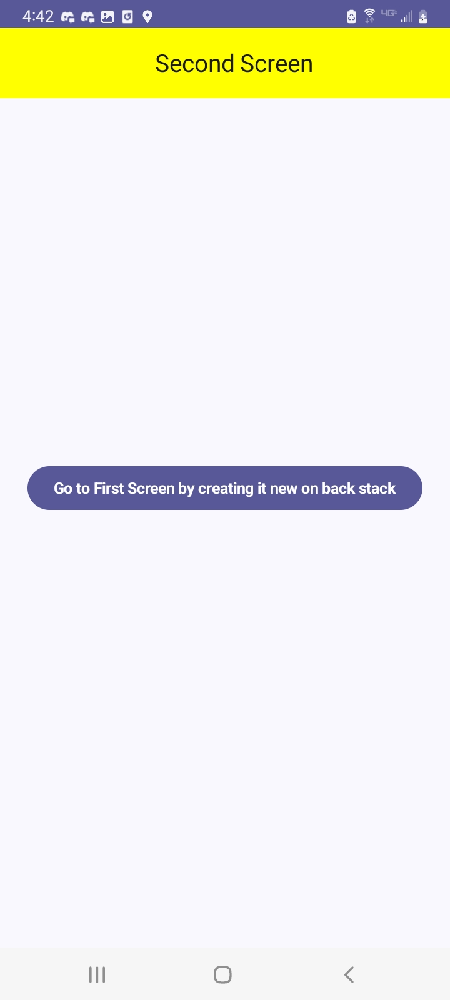
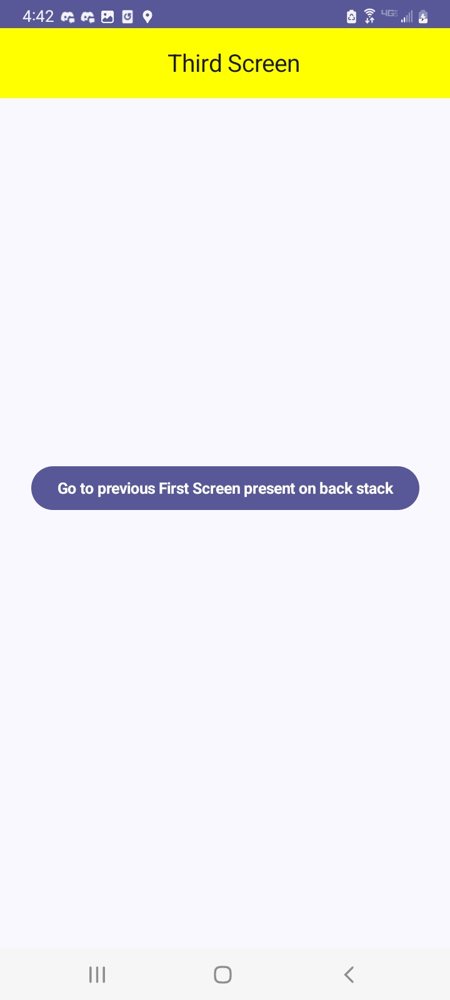

Code sets up a navigation flow between three screens, with each implemented as a composable function. 
The navigation is handled by a NavController, for user actions using buttons. Each screen is 
encapsulated within a Scaffold, providing a basic layout structure including a top app bar, for 
individual screen. 

